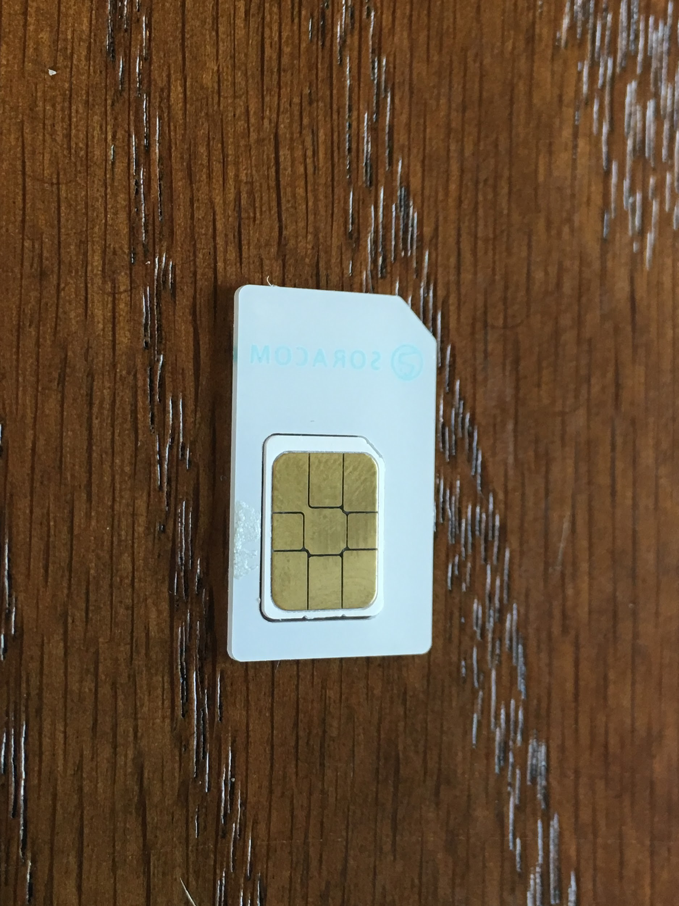

# 事前準備 ～ SORACOM Air でインターネットに接続する

本章では、受講に先立って必要な環境構築の作業について説明します。

## <a id="software">準備するもの</a>

* パソコン / 1台
  * インターネットに接続できる環境
    * 接続先の Wi-Fi アクセスポイントへの制限がかかっていない事
  * OS: Windows(8.1 もしくは 10) もしくは macOS (10.11 El Capitan 以上)
    * Google Chrome 推奨
    * ブラウザでのアクセス制限がかかっていない事
* Raspberry Pi 3 Model B もしくは Raspberry Pi 3 Model B+ / 1台
  * [事前構成済み Raspbian OS](#presetup) インストール済み micro SD カード / 1つ
  * USB ドングル型モデム / 1個
* SORACOM Air SIM / 1枚

### Windows の場合

* TeraTerm 等 SSH が可能なソフトウェア

### macOS の場合

追加で準備する必要はありません。次へ進んでください。

## <a id="1-0">ユーザーコンソールを使用してAir SIMを管理する</a>

ここでは、SORACOM ユーザーコンソール(以降、ユーザーコンソール)を使用して、SORACOM AirのSIM (以降、Air SIM)をSORACOMのユーザーアカウントに登録します。

### <a id="1-1">SORACOM ユーザーコンソールへのログイン</a>

https://console.soracom.io/ にアクセスしログインします。

手元のSIMが未登録の場合は、左上の [SIM登録] ボタンをクリックします。

「SIM登録」画面で、Air SIM の台紙の裏面に貼ってある IMSI と PASSCODE を入力してください。

名前は「<お名前SIM>」などわかりやすいもの、グループは空欄のままでも構いません。
「技術基準適合証明等について確認しました」チェックボックスを付けてください。
[登録] を押して SIM 登録を完了してください。（複数の Air SIM を続けて登録することも可能です。）

Air SIM を登録した直後の状態は「準備完了」と表示され、通信可能な状態になっています。既に利用している場合は「使用中」と表示されます。ただし、まだセッションは確立されていないので、セッション状態は「オフライン」になっていることを確認してください。

SORACOMではSIMの登録や「使用開始」「休止」「解約」といったモバイル通信の状態の更新をユーザー自身がユーザーコンソールを使用して、実施することが可能です。

なお、初めての通信、もしくは、ユーザーコンソール/APIで使用開始処理を行うことで、状態は「使用中」に変わります。 まだ通信を行いたくない場合は、ユーザーコンソールもしくはAPIで休止処理を行ってください。これにより「休止中」の状態となり通信は行われません。

## <a id="2-0">Raspberry Pi の起動とSIMの状態確認</a>

SORACOMが実施するハンズオンでは、事前にOSを初期化した Raspberry Pi を用意してあります。 以下の手順でSIMとUSBドングルを接続し、インターネットに接続している様子を確認します。 

### <a id="2-1">Raspberry Pi に USBドングルを接続する</a>

Air SIMを取り外します。Air SIMの端子を触らないように気をつけます。

取り付けが完了したら、USB ドングル型モデムのふたなどを戻して、 Raspberry Pi の USB ポートに取り付けてください。（ポートの場所はどこでもかまいません）

ACアダプタを接続し、Raspberry Piを起動します。しばらく待つとインターネットに接続されるので、ユーザーコンソールのセッション状態が「オンライン」になることを確認してください。

### <a id="2-2">ユーザーコンソールによる通信の確認</a>

ユーザーコンソールでは、データ通信量をSORACOM AirのSIM(以降、Air SIM)ごとにチャート形式で確認することができます。

データ通信量を確認したいAir SIMにチェックを入れ [詳細] ボタンをクリックします。

[SIM 詳細] ダイアログが表示されますので、[通信量履歴] タブを開きます。 データ使用量は、表示期間を変更することもできます。

> データ通信量が反映されるまでに5〜10分かかります。先ほどのデータ通信が反映されていない場合はしばらくお待ちください。

## 以上で本章は終了です

達成状況を運営表へご記入ください。

* [目次ページへ戻る](../index)

## Appendix

### <a id="presetup">事前構成済み Raspbian OS</a>

本ハンズオンで配布している事前構成済み Raspbian OS の仕様は以下の通りです。

* 起動時の SSH 有効化

これらの設定は https://www.raspberrypi.org/documentation/configuration/wireless/headless.md に基づいて行っています。

