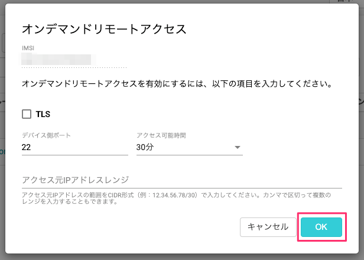
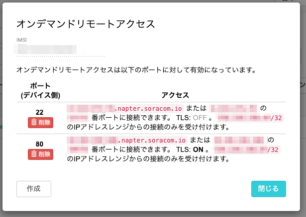

# SORACOM Napter を使用して、 IP ベースの遠隔操作

本章では SORACOM Napter を使用して PC から SORACOM Air SIM への遠隔操作を行います。

## ハンズオンのゴール

遠隔操作用の PC から、 Raspberry Pi に SSH でログインし、Raspberry Pi 内の設定を変更します。

## SORACOM Air SIM に SORACOM Napter を設定する

NapterでSSH(22番ポート)とWebサーバー(80番ポート)にリモートアクセスする設定を以下の手順で追加します。Webサーバーで用いるHTTPプロトコルは暗号化の仕組みがないため、NapterでTLS暗号化を設定しHTTPSプロトコルによるセキュアなリモートアクセス設定にします。

SORACOM ユーザーコンソールの左上 [Menu] から [SIM 管理] をクリックし、 「操作」 - 「オンデマンドリモートアクセス」を選択します。


「オンデマンドリモートアクセス」画面では、リモートアクセスするデバイス側ポートの接続設定やリモートアクセスを許可するアクセス元IPアドレス帯域などを設定します。今回はSSHのポート番号 `22` 、接続時間30分(どちらも既定値)のまま [OK] をクリックします。



画面が切り替わり「オンデマンドリモートアクセスが正常に構成されました」とメッセージが表示されたら、 [全てのリモート接続設定を表示] ボタンを押します。


オンデマンドリモートアクセス画面に表示される22番ポートの [アクセス] 列にある `xx-xx-xx-xx.napter.soracom.io:12345` のうち `:` の前をホスト名、後ろをアクセスポート番号としてそれぞれメモしておきます。



## 遠隔操作用の PC からログインする

遠隔操作用の PC から、Raspberry Pi に SSH でログインしてみましょう。  

**メモした IP アドレス、アクセスポート番号が必要となります。**

### SSH でログインして Raspberry Pi の LED を制御する

SORACOM Air SIM 経由で SSH ログインをし、ログイン先 Raspberry Pi の LED を制御してみましょう。

他の端末から、自分の Raspberry Pi にログインします。  
※ 以下は macOS の場合です。Windows の場合は TeraTerm 等を利用してください

```console
ssh -p <アクセスポート番号> pi@<IP アドレス>
# ログインパスワードを聞かれたら、 raspberry と入力
```

ログインができたら、以下のコマンドでログイン先の Raspberry Pi の赤色 LED を点滅させます。

```console
echo heartbeat | sudo tee /sys/class/leds/led1/trigger
```

ログイン先の Raspberry Pi の 赤色 LED の点滅が始まったことを確認してください。  
点滅を停止する時は以下のコマンドになります。

```console
echo input | sudo tee /sys/class/leds/led1/trigger
```

※ 確認が完了したら `exit` でログアウトしましょう

リモートからSORACOM Air SIM への IP による遠隔操作が確認できました。

## 以上で本章は終了です

達成状況を運営表へご記入ください。

* [目次ページへ戻る](../index)
